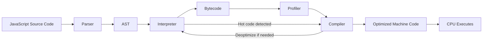
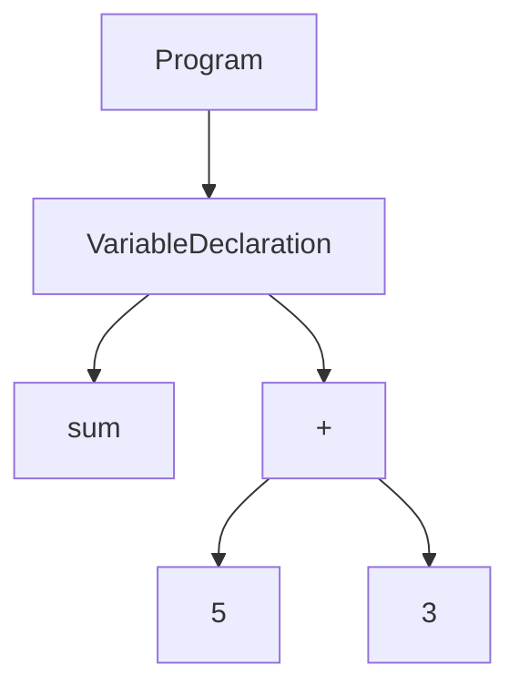
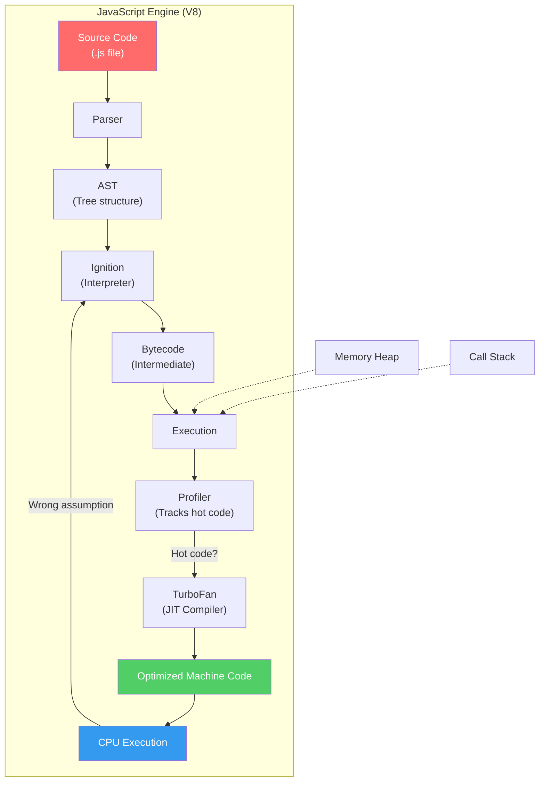
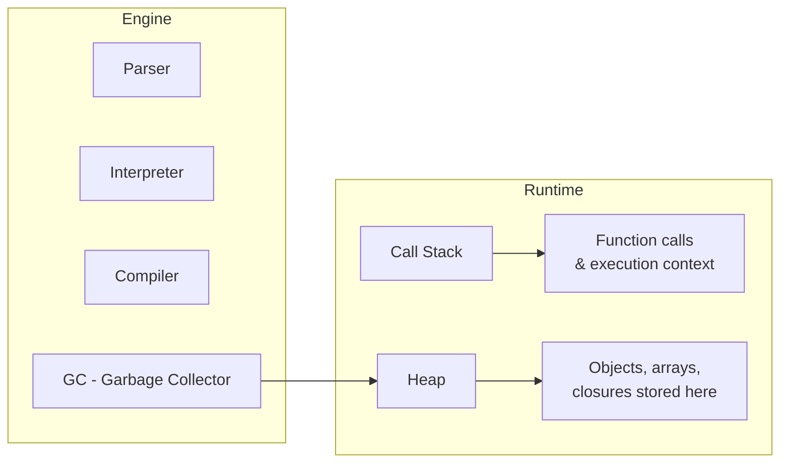

# How JavaScript Engine Works

## 1. What is a JavaScript Engine?

> A JavaScript engine is a program that reads JavaScript code and converts it into machine code that the computer's processor can execute.

Examples: V8 (Chrome/Node.js), SpiderMonkey (Firefox), JavaScriptCore (Safari).

---

## 2. High-Level Flow Diagram



---

## 3. Step-by-Step Breakdown

### Step 1: Parsing — Source Code → AST

The engine **tokenizes** and **parses** your code into an **Abstract Syntax Tree (AST)**.

- **Tokenizing**: Breaks code into tokens (keywords, identifiers, operators).
- **Parsing**: Builds a tree structure from tokens.

**Example:**

```javascript
let sum = 5 + 3;
```

Becomes an AST like:



> The AST is a data structure that represents the logical structure of the code.

---

### Step 2: Interpreter — AST → Bytecode

The **interpreter** walks the AST and generates **bytecode** (an intermediate, low-level representation).

- Bytecode is **not machine code** yet — it's more compact and easier to execute.
- Bytecode runs on a **virtual machine** inside the engine.
- Example engines: V8's **Ignition** interpreter.

**Flow:**


---

### Step 3: Profiler — Monitoring Hot Code

While executing bytecode, the **profiler** watches which functions are called frequently (called **hot code**).

- Tracks execution counts
- Identifies performance bottlenecks
- Decides which code to optimize

> Hot code = functions called many times or loops running for long.

---

### Step 4: Compiler — Bytecode → Optimized Machine Code

When hot code is found, the **JIT (Just-In-Time) Compiler** kicks in:

- Compiles bytecode directly to **machine code**
- Applies optimizations (inlining, type specialization, etc.)
- Machine code runs directly on CPU — **much faster**

Example engines: V8's **TurboFan** compiler.


---

### Step 5: Deoptimization — When Assumptions Fail

If the JIT compiler made an assumption (e.g., "this variable is always a number") and it turns out wrong:

- The engine **deoptimizes** — falls back to bytecode
- It may re-optimize later with new information

> Deoptimization is like saying: "I assumed wrong, let me take the slower but safer path."

---

## 4. Complete Engine Cycle



---

## 5. Key Concepts in Simple Words

| Concept | Simple Meaning |
|---------|---------------|
| **Parsing** | Reading code and understanding its structure |
| **AST** | A tree representation of your code |
| **Bytecode** | A lower-level version of your code, not yet machine code |
| **Interpreter** | Reads and executes bytecode line by line |
| **JIT Compiler** | Converts hot bytecode to machine code for speed |
| **Profiler** | Watches which code runs the most |
| **Machine Code** | Binary instructions the CPU understands |
| **Deoptimization** | Falling back from fast code to slow but correct code |

---

## 6. Memory Components



- **Call Stack**: Where function calls are tracked (LIFO — Last In, First Out)
- **Heap**: Where objects, arrays, and closures live
- **Garbage Collector**: Automatically frees memory no longer in use

---

## 7. Why This Matters

- **Interpreters** start fast but run slow — great for startup
- **Compilers** start slow but run fast — great for long-running apps
- JIT compilation combines both: **fast startup + fast execution**
- Node.js uses V8 — same engine as Chrome — so this applies to backend JavaScript too

---

## 8. Summary

1. You write **JavaScript**
2. The **Parser** converts it to an **AST**
3. The **Interpreter** turns AST into **bytecode** and executes it
4. The **Profiler** watches for **hot code**
5. The **JIT Compiler** optimizes hot code into **machine code**
6. **CPU** runs the machine code directly at full speed
7. If assumptions fail, the engine **deoptimizes** and goes back to bytecode
